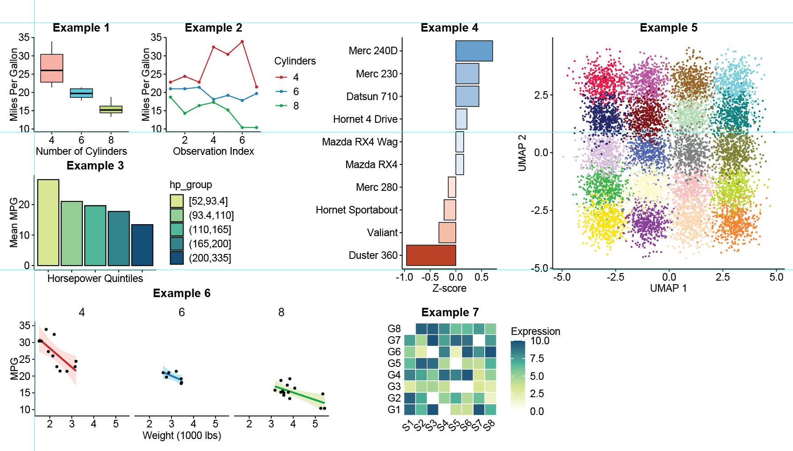

# wulabplot: Standardized Scientific Plotting for Journal Publications

The `wulabplot` R package is a `ggplot2` plugin that provides specialized themes and saving functions designed to meet the rigorous layout requirements of diverse journals. It enforces a minimalist aesthetic using 6-pt Arial fonts, precise 0.5-pt line weights, and consistent panel sizing across all lab publications for perfect alignment.

For more layout information, please refer to the `plotting standard.ai` Illustrator file.

## Features

* **Precision Theme**: `theme_wulab()` implements 6 pt Arial base fonts and perfectly scaled 0.5 pt axis lines. It removes all background rectangles to provide a transparent background for seamless editing in Adobe Illustrator.
* **Absolute Panel Sizing**: `save_wulab()` forces figure panels to exact centimeter dimensions, ensuring identical data areas regardless of axis label length or faceting.
* **Color Standards**: Built-in visualization tools for lab-approved qualitative, sequential, and diverging palettes inspired by traditional aesthetics.

## Installation

You can install the development version of `wulabplot` from GitHub:

```r
# install.packages("devtools")
devtools::install_github("sihanwusean/wulabplot")
```

## Usage

1. Apply the Lab Theme

    Use `theme_wulab()` to instantly apply 6-pt Arial typography and 0.5-pt axis lines.

    ```r
    library(ggplot2)
    library(wulabplot)

    ggplot(mtcars, aes(x = wt, y = mpg)) +
        geom_point() +
        labs(title = "Figure 1A", x = "Weight", y = "MPG") +
        theme_wulab()
    ```

1. Save with Forced Dimensions

    The `save_wulab()` function is facet-aware and ensures every panel in the plot matches your requested size.

    ```r
    # Save the last plot as a standard 2x2 cm square
    save_wulab(type = "2x2", filename = "Figure_1.pdf")
    ```

    Standard Presets (Width x Height in cm):

    * 2x2: Standard square panel (2.0 x 2.0 cm).
    * 2.58x2: Wide format for multi-group plots (2.58 x 2.0 cm).
    * 2x4.9: Vertical profiling (2.0 x 4.9 cm).
    * 4.9x2: Horizontal kinetic data (4.9 x 2.0 cm).
    * 4.9x4.9: Large square for complex datasets (4.9 x 4.9 cm).
  
    Supports `PDF`, `TIFF`, and `PNG`.

1. Explore Color Palettes

    View colors and their HEX codes in the R console.

    ```r
    # 12 paired colors (Chinese aesthetics) + 3 background greys
    show_color_qualitative()

    # Sequential gradient: Creamy Avocado (#d9ed92) to Moroccan Blue (#184e77) via a Teal midpoint (#52b69a)
    show_color_sequential(n = 9)

    # Diverging gradient: Orange-red (#bb3e03) to Blue-cyan (#0380bb) with a White (#ffffff) midpoint
    show_color_diverging(n = 11)

    # Sasha Trubetskoy's 20-color palette, optimized for high-contrast UMAP cluster visualization.
    show_color_umap()
    ```

1. Apply Color Palettes

   See more example in `Examples.R`.

   ```r
   # Choose from qualitative-pair, qualitative-deep, qualitative-light, sequential, diverging, and umap.
   # Support discrete or continous data for sequential and diverging.
   # Support colors for NA values and reversed palette order.

   scale_fill_wulab(type = "qualitative-light") 
   scale_color_wulab(type = "qualitative-deep")
   ```

## Technical Standards

* **Typography:** Axis titles/text are set to 6-pt Arial; plot titles are 7-pt bold Arial.

* **Line Weights:** Axis lines and ticks are precisely calculated using a DPI scaling factor to ensure they appear as exactly 0.5-pt in vector software.

* **Export:** All figures are exported using `cairo_pdf` with a transparent background to ensure font embedding and high-quality vector editing.

## Examples

Use `Examples.R` to reproduce the examples below. This plotting style enables (almost) perfect alignment of each X-Y panel.



## Disclaimer

`wulabplot` is an internal side project developed by the Wu Lab (mostly by the PI at the moment) to ensure a consistent visual identity across our research publications.

**Aesthetics:** The design choices (e.g., 6-pt Arial, specific color palettes) are tailored to our internal preferences and the requirements of our target journals. These may not align with your personal or institutional aesthetic standards.

**Maintenance:** This package is maintained on an ad-hoc basis. We do not guarantee frequent updates, bug fixes, or long-term support.

**Support:** At this time, we only prioritize and address bug reports or feature requests originating from members of the Wu Lab.

External users are welcome to use the package as-is under the MIT License, but should do so with the understanding that it is a specialized tool for our specific research context.

## Changelog

* **Version 0.4.0** - May 2, 2026
  
  **New Features**: `save_wulab()` now supports `PDF`, `TIFF`, and `PNG` file types.
  
  **Misc. items**: Improved internal helper functions; bug fixed for documentations; better handling for errors and exceptions.


* **Version 0.3.0** - Apr 24, 2026
  
    **New Features**

  * **Integrated Palette Scales:** `Added scale_color_wulab()` and `scale_fill_wulab()` to provide direct ggplot2 integration for all lab-standard palettes.
  
    * Supports `qualitative-deep`, `qualitative-light`, `qualitative-pair`, `sequential`, `diverging`, and `umap` types.

    * Includes a `discrete` toggle to switch between categorical mapping and continuous gradients.

    * Supports standardized grey shades (`G1`, `G2`, `G3`) for `na.value` handling.

    * UMAP Standard: Introduced `show_color_umap()`, implementing [Sasha Trubetskoy’s 20-color palette](https://sashamaps.net/docs/resources/20-colors/) optimized for high-dimensional single-cell cluster visualization.
  
  * **Documentation:** Expanded GitHub `README.md` and R code `Examples.R` to include example figures and layout.

* **Version 0.2.2** - Apr 22, 2026
  
  **Bug fix**
  
  * **Palette Refinement:** Updated the diverging palette to an Orange-red (`#bb3e03`) to Blue-cyan (`#0380bb`) transition with a true White (`#ffffff`) midpoint for improved differential expression heatmaps.

* **Version 0.2.1** - Apr 22, 2026
  
  Initial commit.
