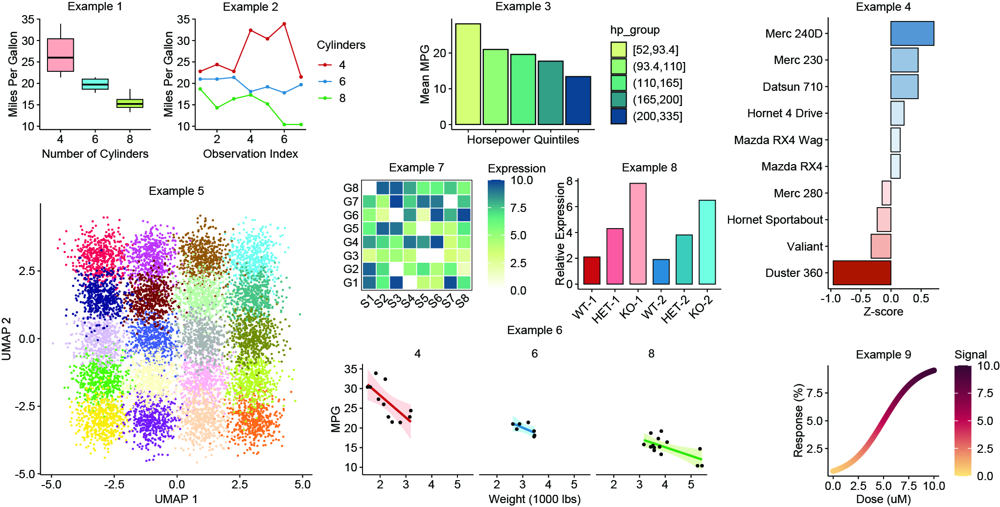
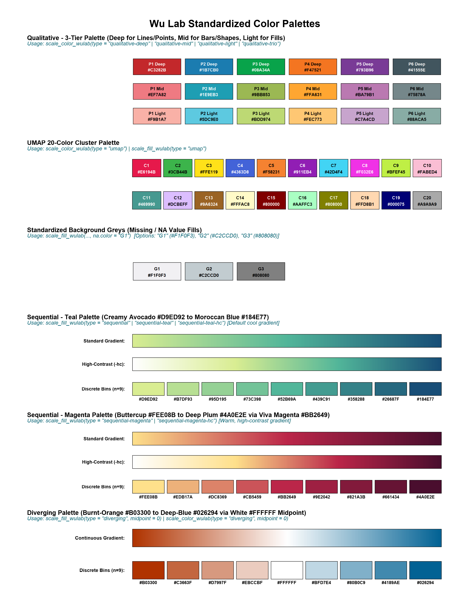

# wulabplot: Standardized Scientific Plotting for Journal Publications

The `wulabplot` R package is a `ggplot2` plugin that provides specialized themes and saving functions designed to meet the rigorous layout requirements of diverse journals. It enforces a minimalist aesthetic using 6-pt Arial fonts, precise 0.5-pt line weights, and consistent panel sizing across all lab publications for perfect alignment.

For more layout information, please refer to the `plotting standard.ai` Illustrator file.

## Features

* **Precision Theme**: `theme_wulab()` implements 6 pt Arial base fonts, perfectly scaled 0.5 pt axis lines, and calibrated title spacing. It removes all background rectangles to provide a transparent background for seamless editing in Adobe Illustrator.
* **Absolute Panel Sizing, Auto Colorbar & Overflow Preservation**: `save_wulab()` forces figure panels to exact centimeter dimensions, ensuring identical data areas regardless of axis label length or faceting. Automatically scales continuous colorbars (`match_colorbar = TRUE`) and preserves overflowing legends and titles within the PDF artboard (`preserve_overflow = TRUE`) for downstream editing in Illustrator.
* **3-Tier Qualitative & Gradient Standards**: Features an expanded 3-tier qualitative system (18 swatches: Deep, Mid, Light) for hierarchical multi-level experiments, alongside sequential, high-contrast, diverging, and UMAP palettes. Includes automatic data-type recognition, zero-anchored diverging midpoints, continuous `limits` squishing, and `show_wulab_colors()` for a printable Letter-size guide.

## Installation

You can install the development version of `wulabplot` from GitHub:

```r
# install.packages("devtools")
devtools::install_github("sihanwusean/wulabplot")
```

## Usage

1. Apply the Lab Theme

    Use `theme_wulab()` to instantly apply 6-pt Arial typography and 0.5-pt axis lines.

    ```r
    library(ggplot2)
    library(wulabplot)

    ggplot(mtcars, aes(x = wt, y = mpg)) +
        geom_point() +
        labs(title = "Figure 1A", x = "Weight", y = "MPG") +
        theme_wulab()
    ```

1. Save with Forced Dimensions

    The `save_wulab()` function is facet-aware and ensures every panel in the plot matches your requested size. It also automatically scales continuous colorbars to match the panel length.

    ```r
    # Save the last plot as a standard 2x2 cm square
    save_wulab(type = "2x2", filename = "Figure_1.pdf")

    # Save a heatmap with panel-matched colorbar dimensions
    save_wulab("Heatmap.pdf", p_heatmap, type = "4.9x4.9")

    # Custom panel dimensions (in cm) for specialized layouts
    save_wulab("Custom_Plot.pdf", p, custom_width = 3.5, custom_height = 2.5)
    ```

    Standard Presets (Width x Height in cm):

    * 2x2: Standard square panel (2.0 x 2.0 cm).
    * 2.58x2: Wide format for multi-group plots (2.58 x 2.0 cm).
    * 2x4.9: Vertical profiling (2.0 x 4.9 cm).
    * 4.9x2: Horizontal kinetic data (4.9 x 2.0 cm).
    * 4.9x4.9: Large square for complex datasets (4.9 x 4.9 cm).
  
    Supports `PDF`, `TIFF`, and `PNG`.

1. Explore Color Palettes

    Display all color palettes and HEX codes on a unified, Letter-size (8.5 x 11 in) publication reference guide or export to PDF/PNG.

    ```r
    # Display unified color palette guide (in RStudio Plots pane or export to file)
    show_wulab_colors()
    show_wulab_colors("wulab_colors.pdf")

    # Individual palette reference visualizers:
    # 18-color 3-tier qualitative palette (Deep, Mid, Light) + 3 background greys
    show_color_qualitative() # defaults to type = "trio" (all 18 colors)
    show_color_qualitative(type = "mid")  # or "deep", "light", "pair"

    # Standard sequential gradient: Creamy Avocado (#d9ed92) to Moroccan Blue (#184e77) via Teal (#52b69a)
    show_color_sequential(n = 9, type = "teal") # or show_color_sequential("teal")

    # Warm sequential gradient: Buttercup (#fee08b) to Deep Plum (#4a0e2e) via Viva Magenta (#bb2649)
    show_color_sequential(n = 9, type = "magenta")

    # High-contrast sequential gradients: Pure White (#ffffff) baseline for unidirectional heatmaps
    show_color_sequential_hc(type = "teal")
    show_color_sequential_hc(type = "magenta")

    # Diverging gradient: Burnt-orange (#b03300) to Deep-blue (#026294) with a White (#ffffff) midpoint (symmetrical depth L* = 40.8)
    show_color_diverging(n = 9)

    # Sasha Trubetskoy's 20-color palette, optimized for high-contrast UMAP cluster visualization.
    show_color_umap()
    ```

1. Apply Color Palettes

   See more examples in `Examples.R`.

   ```r
   # Choose from qualitative-deep, qualitative-mid, qualitative-light, qualitative-pair, 
   # qualitative-trio, sequential (or sequential-teal), sequential-hc (or sequential-teal-hc),
   # sequential-magenta, sequential-magenta-hc, diverging, and umap.
   # Automatically detects discrete factors/characters vs continuous numeric vectors.
   # Supports midpoint anchoring and continuous limits with automatic out-of-bounds squishing.

   scale_fill_wulab(type = "qualitative-light") 
   scale_color_wulab(type = "qualitative-deep")
   scale_color_wulab(type = "qualitative-mid")  # Intermediate balanced tones
   scale_fill_wulab(type = "qualitative-trio")  # 18 colors interleaved by hue (WT / HET / KO)
   scale_fill_wulab(type = "sequential-hc", limits = c(0, 100)) # Default teal high-contrast heatmap palette
   scale_fill_wulab(type = "sequential-magenta", limits = c(0, 100)) # Warm viva-magenta gradient
   scale_fill_wulab(type = "diverging", midpoint = 0, limits = c(-2, 2)) # Zero-anchored continuous scale
   ```

## Technical Standards

* **Typography:** Axis titles/text and plot title are set to 6-pt Arial; plot titles come with calibrated bottom spacing (`margin(b = 3.5, unit = "pt")`).

* **Line Weights:** Axis lines and ticks are precisely calculated using a DPI scaling factor to ensure they appear as exactly 0.5-pt in vector software.

* **Export:** All figures are exported using `cairo_pdf` with a transparent background to ensure font embedding and high-quality vector editing.

## Examples

Use `Examples.R` to reproduce the examples below. This plotting style enables (almost) perfect alignment of each X-Y panel.



The standardized color palettes `show_wulab_colors()` since version 0.8.0 are shown as below.



## Disclaimer

`wulabplot` is an internal side project developed by the Wu Lab (mostly by the PI at the moment) to ensure a consistent visual identity across our research publications.

**Aesthetics:** The design choices (e.g., 6-pt Arial, specific color palettes) are tailored to our internal preferences and the requirements of our target journals. These may not align with your personal or institutional aesthetic standards.

**Maintenance:** This package is maintained on an ad-hoc basis. We do not guarantee frequent updates, bug fixes, or long-term support.

**Support:** At this time, we only prioritize and address bug reports or feature requests originating from members of the Wu Lab.

External users are welcome to use the package as-is under the MIT License, but should do so with the understanding that it is a specialized tool for our specific research context.

## Changelog

* **Version 0.8.0** - September 17, 2026

  **New Features & Enhancements**:

  * **Qualitative 3-Tier Palette Expansion (18 Colors)**: Expanded the lab's signature qualitative color system from a 2-tier system (12 colors) into a comprehensive 3-tier system (18 colors: Deep, Mid, Light). Introduces 6 intermediate mid-tier tones (Red `#ef7a82`, Blue `#1e9eb3`, Green `#9bb853`, Orange `#ffa631`, Purple `#ba79b1`, Slate `#75878a`) optimized for perceptual uniformity and visual harmony via CIELAB/HCL metrics.
  * **New Palette Types (`qualitative-mid` & `qualitative-trio`)**: Added `type = "qualitative-mid"` (6 intermediate shades) and `type = "qualitative-trio"` (18 colors interleaved by hue: Deep, Mid, Light) for multi-level hierarchical groupings (e.g. WT / HET / KO, Day 0 / Day 3 / Day 7). Fully maintains 100% backwards compatibility for `qualitative-deep`, `qualitative-light`, and `qualitative-pair`.
  * **Preserve Canvas Overflow Elements (`preserve_overflow = TRUE`)**: Fixed element clipping in `save_wulab()`. Elements exceeding the calculated figure boundary (such as wide titles, subtitles, or expansive top/bottom legends) now have outer padding automatically added to the figure margins so they remain fully editable within the Illustrator artboard without clipping, while strictly preserving requested data panel dimensions (e.g. exactly 2.0 x 2.0 cm).
  * **Updated Reference Poster (`show_wulab_colors()`)**: Re-rendered the Letter-size (8.5 x 11 in) lab color guide to showcase all 18 qualitative swatches in a 3-row layout (Deep, Mid, Light) with individual HEX codes, labels, and usage guidance.
  * **Enhanced `show_color_qualitative()`**: Now displays the 18-color 3-tier system by default (`type = "trio"`), with selective tier inspection options for `"pair"`, `"deep"`, `"mid"`, and `"light"`.
  * **Symmetrical High-Contrast Diverging Palette**: Upgraded the diverging palette from `#bb3e03` / `#0380bb` to Burnt-orange (`#b03300`) and Deep-blue (`#026294`) around a pure White (`#ffffff`) midpoint. Eliminates the previous luminance imbalance ($\Delta L^* = 6.4 \to 0.0$ at $L^* = 40.8$), ensuring positive and negative fold-changes carry identical visual prominence on screens and print.
  * **Viva Magenta Sequential Palette & Future-Proof Aliases**: Introduced a warm, high-chroma sequential palette family inspired by Pantone 2023 Viva Magenta: `sequential-magenta` (Buttercup `#fee08b` $\to$ Viva Magenta `#bb2649` $\to$ Deep Plum `#4a0e2e`) and its pure white-baseline variant `sequential-magenta-hc`. Viva Magenta acts as a high-chroma bridge ($C^* = 61.8$) preventing muddy midtones. Added future-proof aliases for the default cool sequential palette (`sequential-teal`, `sequential-teal-hc`, `teal`, `teal-hc`) while retaining 100% backwards compatibility for `sequential` and `sequential-hc`.
  * **Updated Reference Poster Layout**: The unified Letter-size guide (`show_wulab_colors()`) now cleanly displays both Sequential Teal and Sequential Magenta (each with standard continuous gradient, high-contrast gradient, and 9 discrete bins) alongside the qualitative 3-tier, UMAP 20-color, background greys, and symmetrical diverging palettes.

* **Version 0.7.0** - September 1, 2026

  **New Features & Enhancements**:

  * **Continuous Limits & Out-Of-Bounds Handling (`limits`)**: Added the `limits = c(min, max)` parameter to `scale_color_wulab()` and `scale_fill_wulab()`. For continuous scales, out-of-bounds values are automatically squished to the extreme palette colors (`oob = scales::squish`) rather than mapped to missing values. Issues a validation warning if `limits` is passed to discrete scales.
  * **Automatic Colorbar Dimension Matching (`match_colorbar = TRUE`)**: `save_wulab()` now automatically resizes continuous colorbar legends to match the exact dimensions of the data panel (height for vertical colorbars, width for horizontal colorbars) with symmetrical padding balancing, ensuring perfect alignment with the X-Y coordinate bounds without manual configuration.
  * **Standardized Plain Plot Titles**: Updated `plot.title` in `theme_wulab()` to use `face = "plain"` (6-pt regular Arial, centered) instead of bold font, keeping visual focus on the data.
  * **Enhanced Dimension Error Guidance**: Improved `save_wulab()` error messaging when an unsupported `type` is supplied, explicitly guiding users to choose from standard presets or use `custom_width` and `custom_height` for non-standard plot layouts.

* **Version 0.6.0** - July 31, 2026

  **New Features & Enhancements**:

  * **Unified Color Palette Visualizer (`show_wulab_colors()`)**: Re-worked color palette visualization into a single, comprehensive Letter-size (8.5 x 11 in) reference poster displaying all 6 Wu Lab palettes (Qualitative Paired, UMAP 20-Color Cluster, Standardized Background Greys, Sequential, Sequential High-Contrast, and Diverging).
  * **Enhanced `save_wulab()` Usability**: Made `save_wulab()` easier to use without needing to explicitly specify the `filename` parameter name (matching `ggsave` positional syntax), while improving default parameter fallback behaviors.

* **Version 0.5.0** - July 23, 2026

  **New Features & Enhancements**:
  
  * **Auto Data-Type Recognition (`discrete = NULL`)**: `scale_color_wulab()` and `scale_fill_wulab()` now automatically detect whether aesthetic data is discrete (factors/characters) or continuous (numeric) and switch scales dynamically.
  * **High-Contrast Sequential Palette**: Added `"sequential-highcontrast"` (alias `"sequential-hc"`) palette (`c("#ffffff", "#d9ed92", "#52b69a", "#184e77")`) and its visualizer `show_color_sequential_hc()`, starting from pure white (`#ffffff`) for unidirectional heatmaps.
  * **Zero-Anchored Diverging Scales**: Continuous `diverging` scales now include an explicit `midpoint = NULL` parameter (defaulting to `0`), ensuring continuous fold-change and Z-score heatmaps anchor white at zero.
  * **Dynamic Legend Guide Sync**: Automatically syncs continuous scales to smooth gradient colorbars (`guide = "colourbar"`) and discrete scales to categorical legend blocks (`guide = "legend"`).
  * **Title Spacing Optimization**: Added calibrated bottom margins to `plot.title` (`margin(b = 3.5, unit = "pt")`) and `strip.text` in `theme_wulab()`, resolving panel crowding while saving page space.

* **Version 0.4.1** - July 16, 2026
  
  **Improvement**: Added an internal `.onLoad` hook (`R/zzz.R`) to automatically register the Arial font family on Windows systems.

* **Version 0.4.0** - May 2, 2026
  
  **New Features**: `save_wulab()` now supports `PDF`, `TIFF`, and `PNG` file types.
  
  **Misc. items**: Improved internal helper functions; bug fixed for documentations; better handling for errors and exceptions.

* **Version 0.3.0** - Apr 24, 2026
  
    **New Features**

  * **Integrated Palette Scales:** Added `scale_color_wulab()` and `scale_fill_wulab()` to provide direct ggplot2 integration for all lab-standard palettes.
  
    * Supports `qualitative-deep`, `qualitative-light`, `qualitative-pair`, `sequential`, `diverging`, and `umap` types.

    * Includes a `discrete` toggle to switch between categorical mapping and continuous gradients.

    * Supports standardized grey shades (`G1`, `G2`, `G3`) for `na.value` handling.

    * UMAP Standard: Introduced `show_color_umap()`, implementing [Sasha Trubetskoy’s 20-color palette](https://sashamaps.net/docs/resources/20-colors/) optimized for high-dimensional single-cell cluster visualization.
  
  * **Documentation:** Expanded GitHub `README.md` and R code `Examples.R` to include example figures and layout.

* **Version 0.2.2** - Apr 22, 2026
  
  **Bug fix**
  
  * **Palette Refinement:** Updated the diverging palette to an Orange-red (`#bb3e03`) to Blue-cyan (`#0380bb`) transition with a true White (`#ffffff`) midpoint for improved differential expression heatmaps.

* **Version 0.2.1** - Apr 22, 2026
  
  Initial commit.
